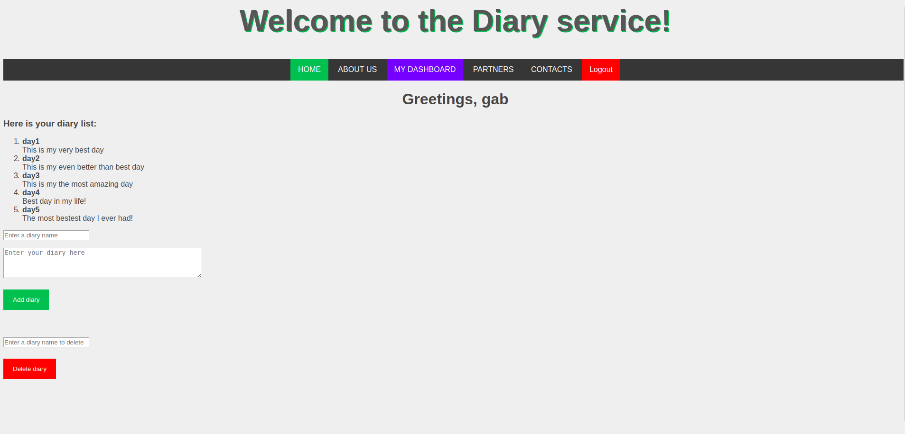

# project-diary

## Web-service for personal diaries.
powered by Java Spring MVC 

Diary service has the following functionality:
 - Registration
 - Signing in
 - Adding notes to the dashboard
 - Deleting notes

Main page

Dashboard page

Main page on mobile

Error page

Design adapted from [https://w3layouts.com](https://w3layouts.com) and [https://www.w3schools.com](https://www.w3schools.com).